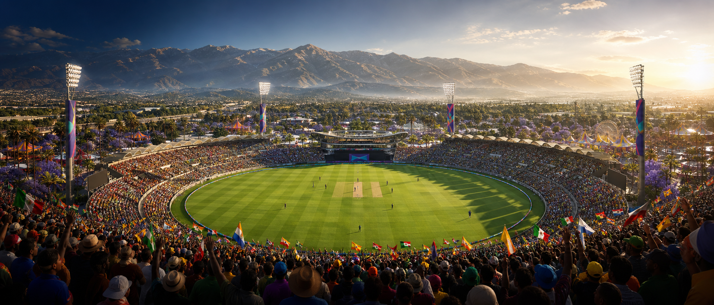
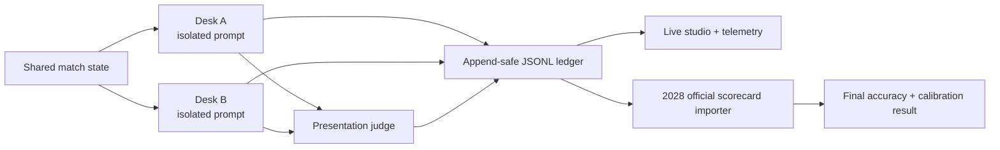

# LA 2028 Women's Cricket LLM Benchmark



[](#project-status)
[](#run-with-real-models)
[](#run-with-real-models)
[](#verification)
[](#license)

An open, hardware-agnostic benchmark for comparing how two language models predict and broadcast a fictional women's T20 campaign on the road to Los Angeles in 2028.

It is part cricket knowledge test, part calibration study, part live broadcast laboratory. Every desk sees the same match state under the same sampling baseline. Neither sees the other desk, the judge, or the hidden fictional result. The real winner of the benchmark cannot be known until official 2028 scorecards exist.

> **Unofficial research project.** This repository is not affiliated with the IOC, LA28, national teams, or venue operators. The seven-match route, commentary, score states, crowds, weather, traffic, and current outcomes are simulated.

## Project status

| Layer | Status |
| --- | --- |
| Two-desk 140-over benchmark | Ready |
| OpenAI-compatible endpoints | Ready |
| Heterogeneous endpoint support | Ready |
| Per-call latency and token telemetry | Ready |
| Prediction and scorecard audit | Ready |
| Pomona broadcast studio | Ready |
| Official 2028 result | **Pending the real tournament** |

The repository deliberately has no official benchmark champion yet. Models make honest predictions now; the official scorecard importer evaluates those locked calls after the real matches.

## The experiment

Two independent model desks cover the same fictional tournament:

- **Desk A** defaults to `qwen/qwen2.5-coder-14b`.
- **Desk B** defaults to `qwen/qwen3-coder-30b`.
- Either desk may be replaced with any model exposed by an OpenAI-compatible API.
- Desk A and Desk B may run on the same endpoint or entirely different providers and machines.
- A configured judge chooses the stronger over-by-over broadcast presentation.
- Prediction accuracy is evaluated separately from presentation quality.

The benchmark records:

- next-match and gold-medal predictions;
- confidence calibration using Brier score;
- Commentary Quality Index (CQI);
- engagement score;
- prediction stability;
- hallucination flags;
- judge head-to-head wins;
- latency, retries, prompt tokens, completion tokens, and tokens per second;
- endpoint role and exact requested sampling parameters.

## Fairness contract



The implementation enforces several anti-bias rules:

1. Both contestant desks use the same fixed sampling baseline.
2. Candidate call order alternates every over, counterbalancing warm-cache, thermal, and first-provider-slot effects.
3. Logs preserve a canonical A/B order even when execution order alternates.
4. A failed contestant call fails the run visibly; it cannot silently disappear.
5. A failed or malformed judge cannot silently favor Desk B. A deterministic local CQI-plus-engagement rubric is used as the fallback.
6. Every run gets a unique JSONL file. The runner refuses to append to a non-empty explicit log path.
7. The model list on every configured endpoint is preflighted before a live run unless the operator deliberately skips that check.
8. Scorecard audits hash both the benchmark log and imported scorecard.

## Fixed sampling baseline

Contestant calls use:

```json
{
  "temperature": 0.2,
  "top_p": 0.9,
  "seed": 42,
  "presence_penalty": 0,
  "frequency_penalty": 0,
  "max_tokens": 300
}
```

The judge has its own fixed low-variance baseline (`temperature=0.1`, `max_tokens=120`). All requested parameters are written into call telemetry.

## Fictional campaign fixture

The included South Africa road-to-gold fixture contains seven fictional matches and 140 team overs:

| Match | Phase | Fixture |
| ---: | --- | --- |
| 1 | Group | South Africa vs Australia |
| 2 | Group | South Africa vs Great Britain (via England) |
| 3 | Group | South Africa vs India |
| 4 | Group | South Africa vs Qualifier 5 |
| 5 | Group | South Africa vs Qualifier 6 |
| 6 | Semifinal | South Africa vs India |
| 7 | Gold-medal final | South Africa vs Australia |

This bracket is a benchmark narrative, **not an official LA28 draw**.

Recurring surreal broadcast moments -- the boundary couch, two ordinary people in sleepwear, a silent spacecraft, and a friendly two-headed visitor -- may appear in commentary. They never alter scores, match outcomes, judging rules, or prediction evaluation.

## Official Los Angeles context

The presentation is grounded in public venue facts while keeping all benchmark data clearly separate:

- LA28 lists cricket as a T20 competition with six-team women's and men's tournaments at **Fairgrounds Cricket Stadium in Pomona**.
- The official venue page describes the **San Gabriel Mountains** as the stadium backdrop and cricket's return to the Games after 128 years.
- LA28 lists **Santa Anita Park in Arcadia** for equestrian competition.
- The Olympic Games are scheduled for **July 14-30, 2028**.

Sources: [LA28 cricket](https://la28.org/en/games-plan/olympics/cricket.html), [Fairgrounds Cricket Stadium](https://la28.org/en/games-plan/venues/fairgrounds-cricket-stadium.html), [updated venue plan](https://la28.org/en/newsroom/la28-celebrates-updated-olympic-venue-plan.html), and [Games dates](https://la28.org/en.html).

## Quick start

Python 3.9+ is required.

```bash
git clone https://github.com/jbrick2070/la28-cricket-benchmark.git
cd la28-cricket-benchmark
python -m pip install -e ".[dev]"
```

Run a deterministic five-over rehearsal without any network model calls:

```bash
la28-run-benchmark --dry-run --overs 5 --delay 0
```

Run the complete synthetic 140-over rehearsal:

```bash
la28-run-benchmark --dry-run --overs 140 --delay 0
```

Each run writes a new file such as:

```text
logs/run_20280714_160000_a1b2c3.jsonl
```

## Run with real models

Verify the configured models first:

```bash
la28-run-benchmark \
  --check-models \
  --endpoint http://localhost:1234/v1 \
  --model-a qwen/qwen2.5-coder-14b \
  --model-b qwen/qwen3-coder-30b
```

Then run:

```bash
la28-run-benchmark \
  --endpoint http://localhost:1234/v1 \
  --model-a qwen/qwen2.5-coder-14b \
  --model-b qwen/qwen3-coder-30b \
  --overs 140
```

The runner performs the model preflight automatically for live campaigns. Use `--skip-model-check` only when the endpoint cannot expose `/v1/models`.

### Different endpoint per desk

```bash
la28-run-benchmark \
  --endpoint-a http://host-a:1234/v1 \
  --endpoint-b http://host-b:8000/v1 \
  --model-a organization/model-a \
  --model-b organization/model-b \
  --judge-model organization/judge \
  --judge-endpoint https://provider.example/v1
```

API keys may be passed with `--api-key-a`, `--api-key-b`, and `--judge-api-key`.

Equivalent environment variables:

| Variable | Purpose |
| --- | --- |
| `LA28_ENDPOINT` | Shared default endpoint |
| `LA28_ENDPOINT_A` | Desk A endpoint |
| `LA28_ENDPOINT_B` | Desk B endpoint |
| `LA28_API_KEY_A` | Desk A API key |
| `LA28_API_KEY_B` | Desk B API key |
| `LA28_MODEL_A` | Desk A model ID |
| `LA28_MODEL_B` | Desk B model ID |
| `LA28_SERVER_HW` | Optional inference hardware label |
| `LA28_CLIENT_HW` | Optional benchmark client label |

## Pomona broadcast studio

The Vite frontend is a first-class visual surface, not a requirement for running the benchmark.

It includes:

- an original cinematic Pomona stadium panorama;
- a live animated trajectory and Hawk-Eye layer;
- a responsive world-feed score ribbon;
- dynamic model names and per-model throughput;
- winning commentary and head-to-head judging;
- seven-match journey visualization;
- clearly labeled simulated weather, attendance, and traffic;
- official venue context for Pomona cricket and Santa Anita equestrian;
- optional synthesized stadium audio and browser voiceover;
- optional OBS-compatible production routes.

Run it in standalone demo mode:

```bash
cd frontend
npm install
npm run dev
```

Open `http://localhost:5173`.

Or build it and serve it alongside the live Python ledger:

```bash
cd frontend
npm run build
cd ..
python -m la28_cricket.dashboard --port 8080
```

Open:

- `http://localhost:8080/studio` for the Pomona broadcast studio;
- `http://localhost:8080` for the compact control dashboard;
- `http://localhost:8080/api/data` for the current normalized ledger view.

If no Python dashboard is reachable, the studio switches to a deterministic browser demonstration and labels itself **Browser demo - simulated**.

## Audit official 2028 scorecards

When an official scorecard exists:

```bash
la28-import-scorecard \
  --log-path logs/run_20280714_160000_a1b2c3.jsonl \
  --scorecard path/to/official_scorecard.json \
  --output audits/run_20280714_audit.json
```

If a historical file contains more than one `run_id`, selection is mandatory:

```bash
la28-import-scorecard \
  --log-path logs/historical.jsonl \
  --run-id run_20280714_160000_a1b2c3 \
  --scorecard path/to/official_scorecard.json
```

The audit output includes:

- selected run ID;
- SHA-256 of the benchmark log;
- SHA-256 of the scorecard;
- official match winners and gold medalist;
- per-model accuracy totals;
- per-model Brier calibration.

## JSONL event model

| Event | Purpose |
| --- | --- |
| `RUN_START` | Run ID, models, endpoints, fixed sampling, prompt version, log path |
| `OVER_EVENT` | Shared state, both calls, call order, predictions, quality, judge, winner, surprise |
| `MATCH_RESOLVED` | Fictional benchmark result and match-level prediction evaluation |
| `CAMPAIGN_SUMMARY` | Completion status, totals, aggregate quality and telemetry |

`completion_status` is `completed`, `interrupted`, or `failed`. A partial or failed campaign never reports itself as successfully complete.

## Repository map

```text
la28_cricket/
  benchmark.py          campaign orchestration and fairness controls
  config.py             schedule, models, endpoints, fixed baselines
  dashboard.py          JSONL adapter and studio/dashboard server
  metrics.py            prediction, calibration, quality, telemetry
  models.py             OpenAI-compatible streaming client
  obs_overlays.py       optional transparent production surfaces
  schema.py             versioned JSONL records
frontend/
  public/               original venue artwork and favicon
  src/                  broadcast UI, canvas animation, demo engine
scripts/
  run_benchmark.py
  verify_remote_endpoint.py
  import_official_scorecard.py
tests/
  fixtures/
  test_*.py
```

## Verification

```bash
python -m compileall -q la28_cricket scripts tests
python -m unittest discover -s tests -p "test_*.py"
cd frontend
npm run build
```

Current baseline: **30 Python tests passing**, including the complete 140-over dry-run, desk isolation, CLI behavior, call-order counterbalancing, failure propagation, match-two scoring, multi-run scorecard selection, and dashboard normalization.

## Design asset

`frontend/public/pomona-stadium-panorama.png` is original AI-generated concept artwork created for this repository. It contains no official Games logo or venue branding and must not be presented as a photograph of a completed venue.

## License

MIT. See [LICENSE](LICENSE).
